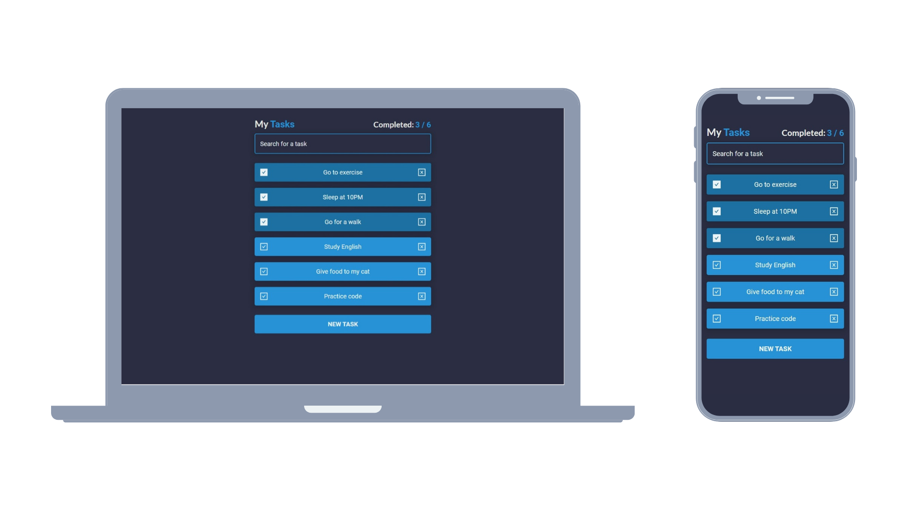

## 📄 Intro

<div align="center">Task App <br><br></div>

[](https://www.carlosmrtzo.com/)

## 💼 Used technologies


## 🚨 Fork this repo

You can fork this repo and please give me proper credit, enjoy 😊

## 🛠 Installation & Set Up

1. Install dependencies

   ```sh
   npm install
   ```

2. Start the development server

   ```sh
   npm run dev
   ```

## 🚀 Building and Running for Production

1. Generate a production build

   ```sh
   npm run build
   ```
